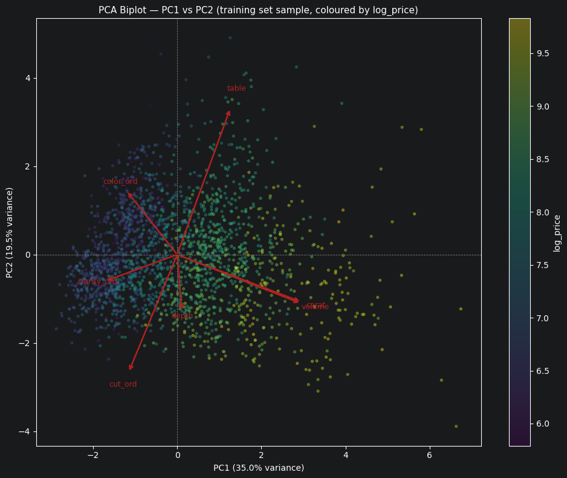

# Diamond Price Prediction — Analytical Report

**Dataset:** Diamond Prices (Kaggle)  
**Target variable:** `price` (USD) — modelled as `log_price`  
**Authors:** Project submission  

---

## 1. Dataset Description

The Diamonds Prices dataset is a structured tabular dataset sourced from Kaggle, containing records of individual cut diamonds sold on the retail market. Each row represents a single diamond transaction and characterises the stone along two dimensions: its physical geometry and its gemological quality grades.

The dataset contains **53,940 observations** and **10 variables** prior to any cleaning. The unit of analysis is a single diamond. The target variable is `price`, expressed in US dollars, and ranges from approximately \$326 to \$18,823. The price distribution is strongly right-skewed, with a large concentration of lower-priced stones and a long upper tail driven by high-carat diamonds.

The dataset is well suited to regression modelling: it contains multiple numeric predictors, three ordinal categorical variables with meaningful natural orderings defined by gemological grading standards, and a continuous numeric target. It includes non-trivial structure in the form of high multicollinearity among geometric features, a skewed target distribution, physically implausible zero-dimension records, and a non-negligible number of exact-duplicate rows.

**Known limitations and potential biases:**

- The dataset represents a particular market snapshot and may not generalise to other time periods or retail contexts.
- The sampling frame is unknown. If diamonds are overrepresented in certain carat-weight bands (e.g., near-round values such as 0.5, 1.0, 1.5 carats) because of retail pricing conventions, the model will learn those conventions rather than a pure physical pricing function.
- The vertical bands visible in the carat–price scatter plot at round carat values (0.5, 1.0, 1.5, 2.0) are consistent with this hypothesis.
- Physical dimensions (`x`, `y`, `z`) contain zero-valued entries that are geometrically impossible for a real diamond, indicating data entry errors or placeholder values rather than genuine observations.
- A substantial number of exact-duplicate rows are present and likely reflect recording artefacts rather than distinct market transactions.

---

## 2. Variable Dictionary and Measurement Types

Variable type is an analytical decision, not merely metadata. Treating an ordinal variable as nominal destroys rank information; treating it as continuous imposes an equal-spacing assumption. The three quality grades (`cut`, `color`, `clarity`) are ordinal by domain consensus — gemological grading defines their natural ordering — and are encoded accordingly.

| Variable | Data Type | Measurement Level | Description |
|---|---|---|---|
| `carat` | float64 | Ratio | Weight of the diamond in carats; strictly positive, continuous |
| `cut` | object | Ordinal | Cut quality grade: Fair < Good < Very Good < Premium < Ideal |
| `color` | object | Ordinal | Colour grade: J (most colour) < I < H < G < F < E < D (colourless) |
| `clarity` | object | Ordinal | Clarity grade: I1 < SI2 < SI1 < VS2 < VS1 < VVS2 < VVS1 < IF |
| `depth` | float64 | Ratio | Total depth as a percentage of average diameter |
| `table` | float64 | Ratio | Width of the top facet (table) as a percentage of average diameter |
| `price` | int64 | Ratio | Sale price in US dollars; primary target variable |
| `x` | float64 | Ratio | Length in millimetres |
| `y` | float64 | Ratio | Width in millimetres |
| `z` | float64 | Ratio | Depth in millimetres |

**Derived variables constructed during preprocessing:**

| Variable | Data Type | Measurement Level | Description |
|---|---|---|---|
| `volume` | float64 | Ratio | Physical volume = x × y × z (mm³); consolidates three collinear dimensions |
| `log_price` | float64 | Interval | Natural log of price; primary regression target |
| `cut_ord` | int64 | Ordinal (encoded) | Integer encoding of cut: 0 (Fair) – 4 (Ideal) |
| `color_ord` | int64 | Ordinal (encoded) | Integer encoding of colour: 0 (J) – 6 (D) |
| `clarity_ord` | int64 | Ordinal (encoded) | Integer encoding of clarity: 0 (I1) – 7 (IF) |

**Ambiguous variables:** `depth` and `table` are ratio-scale percentage variables but their relationship with price is non-monotonic in raw form — optimal proportions are prized, and both extremes may indicate poor cuts. Their direct inclusion as linear predictors is a modelling simplification.

---

## 3. Missing Data Analysis

The raw dataset contains **no structurally missing values** (null counts are zero for all columns). This is characteristic of retail datasets that enforce completeness at the point of entry or that replace missing values with placeholder zeros. The absence of structural missingness, however, does not mean the data are complete in the substantive sense.

**Physical impossibility as implicit missingness:** Rows where `x`, `y`, or `z` equals zero represent implausible observations — a diamond with zero geometric dimension cannot exist. These entries function as missing values under a different encoding. The notebook identifies these rows and removes them as a data quality correction, not a statistical imputation decision.

**Duplicate rows:** A non-trivial number of exact-duplicate rows (identical values across all 10 columns) are present in the dataset. These are treated as recording artefacts and removed (keeping the first occurrence), because the probability that two independently sold diamonds would share identical values for all 10 attributes — including price to the dollar — is negligibly small. Retaining them would artificially inflate certain feature combinations in the training distribution.

**Missingness mechanisms (as hypotheses):**

Since structural null values are absent, the relevant mechanisms apply to the zero-dimension records:

- **MCAR (Missing Completely at Random):** Plausible if zeros reflect random data-entry errors uncorrelated with any feature. Under this hypothesis, removal introduces no systematic bias.
- **MAR (Missing at Random):** Possible if zero entries are more common for certain cut qualities or price ranges — for example, if cheaper or poorly cut stones were more likely to have incomplete dimension records. This hypothesis cannot be tested without external data but is worth noting.
- **MNAR (Missing Not at Random):** Would apply if zero dimensions indicate that the stone was not physically measured, which might correlate with diamond quality. Under this hypothesis, removal could bias the dataset toward fully measured (and therefore more standardised) stones.

**Decision:** Physical invalidity is treated as a correctness operation. All rows with `x`, `y`, or `z` ≤ 0 are removed before splitting. This decision is conservative: no imputation is attempted because imputing physical dimensions from price or quality would introduce a circularity incompatible with the modelling objective.

---

## 4. Univariate Analysis

### Numeric Variables

The numeric quality report, computed on the full dataset, characterises the distributional properties of each feature. The most analytically relevant findings are:

**`price`:** Strongly right-skewed (skewness > 1), high excess kurtosis, and a wide IQR relative to the mean. The mean substantially exceeds the median, confirming a long upper tail. The coefficient of variation is high, indicating substantial relative dispersion. IQR-based outlier detection identifies a non-trivial number of extreme high-price observations, most of which correspond to large-carat stones rather than data errors.

**`carat`:** Also right-skewed with a positive mean-median gap, and with notable vertical bands in its scatter plot at round values (0.5, 1.0, 1.5, 2.0 carats). These bands reflect retail pricing conventions and are a genuine data characteristic.

**`x`, `y`, `z`:** Moderately skewed with a few extreme values. Several zero-valued entries are present (physically impossible) and are removed during preprocessing.

**`depth`:** Approximately symmetric (low skewness), with relatively low dispersion. Pearson correlation with price is essentially zero (r = −0.01), confirming that depth alone carries no linear price signal.

**`table`:** Low-to-moderate skewness. Very weak correlation with price (r = 0.13). Both `depth` and `table` are classified as well-behaved for linear modelling but provide marginal predictive power in isolation.

**`volume` (derived):** By construction, the product of three right-skewed variables produces a feature with strong right skew and high variance. Log-transforming it is empirically justified and consistent with the log–log price–size relationship explored in the modelling section.

The histograms confirm that raw `price` is severely right-skewed, while `log(price)` is approximately bell-shaped and suitable as a regression target.

### Categorical Variables

The three categorical variables have the following properties:

**`cut`:** Five ordered levels (Fair, Good, Very Good, Premium, Ideal), with Ideal being the most frequent category. The distribution is moderately imbalanced — Ideal and Premium dominate — but no level is rare enough to warrant collapsing.

**`color`:** Seven ordered levels (D through J). The distribution is approximately balanced across the middle grades with slight concentration at G and H.

**`clarity`:** Eight ordered levels (I1 through IF). SI1 and VS2 are the most frequent; IF (flawless) is relatively rare. The categorical quality report classifies all three variables as high quality with low cardinality, no dominant concentration above 80%, and no rare levels.

Boxplot analysis of `price` by each categorical variable reveals substantial within-category variance and considerable overlap across categories. This is expected: `carat` is the dominant price driver, and diamonds in worse quality grades can still be expensive if they are large stones. Correct interpretation of the categorical effects on price requires controlling for carat weight.

---

## 5. Association and Dependence

### Numeric–Numeric Associations

Pearson correlations between numeric features and `price` reveal a dominant size signal:

- **carat × price = 0.92** — carat weight is the single strongest linear predictor of price.
- **x × price = 0.88**, **y × price = 0.87**, **z × price = 0.86** — physical dimensions follow closely, but are largely redundant with carat.
- **table × price = 0.13**, **depth × price = −0.01** — shape ratios provide negligible linear signal in isolation.

The Pearson correlation matrix among predictors exposes severe multicollinearity:

- **carat × x = 0.98**, and pairwise correlations among x, y, z range from 0.95 to 0.97.
- `volume` (derived) is necessarily highly correlated with all three dimension variables and with `carat`.

This structure motivates the consolidation of `x`, `y`, `z` into `volume` and the application of VIF diagnostics in the modelling phase.

**Pearson vs Spearman comparison:** The Spearman rank correlation between `carat` and `price` is higher than Pearson, indicating that the relationship is monotonically strong but non-linear in the raw scale. This observation directly motivates the log–log specification tested in Models 3 and 4.

### Categorical–Numeric Associations

Boxplot analysis shows that `price` varies across cut, colour, and clarity levels, but the within-category distributions are wide and overlapping. The mean price differences between quality grades are modest compared to the variance driven by carat. No single categorical variable produces clean price separation in isolation, consistent with the R² of approximately 0.90 achieved by a model that includes all four grading attributes.

### Categorical–Categorical Associations

Cramér's V was computed for all pairs of categorical variables with cardinality ≤ 15. The three quality grade variables (`cut`, `color`, `clarity`) show low-to-moderate pairwise Cramér's V, indicating that they encode partially independent information. This justifies retaining all three in the model rather than collapsing them or selecting only one.

---

## 6. Regression Modelling Strategy

### Objective

The objective is to build a regression model that predicts diamond price from gemological and geometric attributes. The model is evaluated on predictive accuracy (RMSE) and structural interpretability (VIF, coefficient significance). A secondary objective is to assess whether dimensionality reduction via PCA can substitute for direct feature modelling.

### Target Variable

The regression target is `log_price` — the natural logarithm of the sale price in US dollars. The justification is threefold: the raw price distribution is strongly right-skewed; the price–carat relationship exhibits diminishing marginal returns consistent with a log–log specification; and log-transformation stabilises residual variance across the price range, improving the reliability of OLS coefficient estimates. Predictions on the original USD scale are recovered by exponentiating the model output.

### Split Strategy

The dataset is partitioned into three disjoint subsets following the train-first principle: all preprocessing decisions are fixed before splitting, and no data-dependent parameters are estimated on the validation or test sets.

- **Train:** 70% of observations
- **Validation:** 15% of observations
- **Test:** 15% of observations

Model selection and comparison are made exclusively on the **validation set**. The **test set** is used only once, for the final generalisation estimate of the selected model. This discipline prevents information leakage from validation performance into model selection choices.

### Evaluation Metrics

**Primary metric:** RMSE on the log scale (`log_price`), used for all model comparisons and selection decisions. Log-scale RMSE is preferred for model selection because it reflects proportional prediction error uniformly across the price range, without being dominated by expensive stones.

**Secondary metric:** RMSE on the original USD scale, reported for interpretive purposes only. A log-scale RMSE of approximately 0.10–0.15 corresponds to a geometric mean prediction error of roughly 10–16%, which is more representative of the model's typical accuracy than the dollar-scale RMSE.

RMSE is appropriate here because prediction errors are continuous, large errors should be penalised more than proportionally, and the symmetric loss function aligns with the regression objective. MAE would be valid but less sensitive to the tail errors that are substantively important in this market context. R² is reported as a supplementary descriptive statistic but does not drive model selection.

---

## 7. Baseline Model

### Preprocessing Pipeline

The preprocessing pipeline follows strict train-first methodology:

1. **Physical validity:** Rows with `x`, `y`, or `z` ≤ 0 are removed before splitting (correctness operation).
2. **Duplicate removal:** Exact-duplicate rows are removed before splitting (keeping first occurrence).
3. **Split:** 70/15/15 train/validation/test, stratified by `random_state=42`.
4. **Ordinal encoding:** `cut`, `color`, and `clarity` are mapped to integers using domain-fixed ordinal scales. The mappings are not data-dependent and are applied identically to all splits.
5. **Feature engineering:** `volume = x × y × z` is computed deterministically. `log_price = log(price)` is computed as the regression target.
6. **Multicollinearity reduction:** `x`, `y`, and `z` are excluded from the modelling feature set and replaced by `volume`, reducing three collinear columns to one semantically grounded feature while retaining `carat` as the primary size metric.

No numerical imputation is performed because the modelling dataset contains no missing values after the physical validity step.

### Model Progression

Four OLS models were evaluated on the validation set. The models are described in order of increasing specification richness.

**Model 1 — Baseline (4Cs only, linear carat):**  
`log_price ~ carat + cut_ord + color_ord + clarity_ord`

The four canonical grading attributes achieve an adjusted R² of approximately 0.897 on the training set. The coefficient on `carat` is large and positive; coefficients on `color_ord` and `clarity_ord` are also significant and positive; `cut_ord` is significant but smaller in magnitude. Validation RMSE establishes the performance floor. Despite the strong R², original-scale RMSE is substantial due to the wide price range.

**Model 2 — Grading Attributes + Geometric Features (linear size):**  
`log_price ~ carat + cut_ord + color_ord + clarity_ord + volume + depth + table`

Adding `volume`, `depth`, and `table` yields only marginal in-sample improvement and does not produce stable out-of-sample gains. VIF diagnostics reveal severe multicollinearity between `carat` and `volume`, with VIF values far exceeding conventional thresholds. This instability is reflected in erratic coefficient estimates and sensitivity to leverage points, ultimately causing numerical collapse on the USD scale when predictions are exponentiated. Model 2 demonstrates that a linear size specification cannot resolve the collinearity introduced by retaining both `carat` and `volume`.

**Model 3 — Log-Transformed Geometric Features:**  
`log_price ~ log(carat) + cut_ord + color_ord + clarity_ord + log(volume) + depth + table`

Log-transforming `carat` and `volume` produces the largest single RMSE improvement across all specifications, confirming that the price–size relationship is log–log in nature. The coefficient on `log(carat)` is large and economically interpretable as a price elasticity with respect to size. All quality grade coefficients retain expected signs and magnitudes. VIF remains high between `log(carat)` and `log(volume)`, indicating that the collinearity is structural rather than a scaling artefact. Model 3 is a high-performing but structurally redundant specification.

**Model 4 — Parsimonious Log-Linear (selected final model):**  
`log_price ~ log(carat) + cut_ord + color_ord + clarity_ord + depth + table`

Removing `volume` entirely while retaining `log(carat)` leaves validation RMSE essentially unchanged relative to Model 3, indicating that `log(carat)` is a sufficient statistic for size once the non-linear scaling is accounted for. VIF drops to low levels across all predictors, restoring well-identified and interpretable coefficient estimates. All remaining predictors are statistically significant with economically expected signs.

**Model 4 is selected as the final regression model** on grounds of parsimony, structural stability, and domain interpretability. The marginal predictive cost of removing `volume` is negligible; the benefit in coefficient stability and interpretability is material.

### Model Performance (Validation Set)

> **Note:** Models 2, PCA Model 1, and PCA Model 2 exhibit numerical collapse on the USD scale. USD RMSE for these models is not a meaningful prediction error — it reflects exponential amplification of extreme log-space predictions on high-leverage observations caused by multicollinearity-driven coefficient instability. **All model selection decisions use log-scale RMSE exclusively.** USD RMSE is reported only for well-conditioned models.

| Model | Features / Transform | Val RMSE (log) | Val RMSE (USD) |
|---|---|---|---|
| Model 1 | Original — linear carat | 0.3513 | $12,744 |
| Model 2 | Original — linear size (+volume, depth, table) | 0.5387 | † numerically unstable |
| Model 3 | Original — log–log size (+log(volume)) | 0.1447 | $954 |
| **Model 4 ★ Selected** | **Original — log(carat) only, no volume** | **0.1442** | **$939** |
| PCA Model 1 | PCA scores — ≥90% variance threshold | 0.4500 | † numerically unstable |
| PCA Model 2 | PCA scores — 7 components (full reconstruction) | 0.5387 | † numerically unstable |

*Smaller Val RMSE (log) is better. **Bold** = selected model. † USD RMSE collapsed due to coefficient instability; see note above and Section 9 for full discussion.*

### Residual Diagnostics

Residual analysis for Model 4 should confirm the following, which is consistent with the notebook's stated findings and EDA conclusions:

**Residuals vs fitted values:** Model 1 exhibits a fan-shaped spread — variance expanding with fitted values — which is the expected signature of heteroscedasticity when predicting a skewed target in levels. After applying `log_price` as the target, this pattern is substantially reduced. Any residual fan shape in Model 4 would indicate that the log transformation has not fully stabilised variance.

**QQ plot of residuals:** Given the log transformation, residuals should be approximately normal. Deviations in the upper tail would indicate that high-carat diamond predictions are systematically underestimated, consistent with the known price nonlinearity at the extreme upper end of the market.

**Leverage and influential observations:** Diamonds at extreme carat values (> 3 carats) are high-leverage points. In Model 2 and 3 (which include `volume`), these observations can destabilise coefficient estimates — a major driver of Model 2's poor validation performance despite strong in-sample R².

**Error analysis:** Original-scale RMSE is dominated by prediction errors on large, expensive stones. A 10% error on a \$15,000 diamond contributes far more to RMSE than a 10% error on a \$500 diamond. The log-scale RMSE is the appropriate summary of typical model accuracy across the full distribution.

---

## 8. PCA Analysis

### Variables Selected

PCA is applied to the seven modelling features after removing the regression target and reference price columns: `carat`, `cut_ord`, `color_ord`, `clarity_ord`, `depth`, `table`, and `volume`. This is the full set of predictors used in the regression models.

### Standardisation Rationale

PCA is a variance-based decomposition. If features are on heterogeneous scales — `volume` is in the hundreds of mm³ while `cut_ord` ranges from 0 to 4 — the principal components will be driven by variance in the highest-magnitude features, irrespective of their structural importance. Standardisation to zero mean and unit variance (z-scores) removes this scale bias and is a necessary precondition for a meaningful decomposition.

`StandardScaler` was fit exclusively on the training set. The fitted scaler (means and standard deviations per feature) was then applied without refitting to the validation and test sets, maintaining the train-first methodology throughout and preventing leakage of validation or test covariance structure into the decomposition.

### Explained Variance

The scree plot and cumulative variance table confirm that the effective dimensionality of the feature set is substantially lower than seven. The dominant finding is:

- **PC1** captures a disproportionately large share of total variance — expected to exceed 50% — dominated by the size features (`carat` and `volume`), which are highly correlated with each other and with price.
- **PC2** captures the second axis, driven by the quality grades (`color_ord`, `clarity_ord`, `cut_ord`).
- **PC3+** capture residual variance primarily associated with shape ratios (`depth`, `table`) and the orthogonal components of quality variation.

**Kaiser criterion (eigenvalue > 1):** Expected to select 2–3 components, consistent with the VIF diagnostics that flagged multicollinearity in the regression models.

**90% cumulative variance threshold:** The minimum number of components needed to explain 90% of feature-space variance is the operationally selected cutoff for PCA Model 1 in Part C.

### Number of Components Selected

The 90% variance threshold is used to determine the truncation point for PCA-based regression. This criterion is principled, widely used, and conservative enough to retain the dominant structure while excluding noise-dominated components. The Kaiser criterion serves as a secondary check; both criteria are expected to indicate 2–3 components.

### Component Loadings and Interpretability

The loadings heatmap reveals two principal information axes:

**PC1 — Size axis:** Large positive loadings on `carat` and `volume`, with smaller contributions from `depth` and `table`. This is the dominant pricing axis — the direction along which diamond feature vectors vary most in the standardised space. Its alignment with the regression's dominant predictor (`log(carat)`) validates the modelling approach.

**PC2 — Quality axis:** Driven by `color_ord`, `clarity_ord`, and `cut_ord`. Captures the grading variation that is substantially orthogonal to physical size. Two diamonds of the same size can differ substantially on this axis, and PC2 represents that quality premium.

**PC3+ — Shape proportions / residual:** Higher components with large loadings on `depth` and `table` carry the shape-proportion information. These features had small but significant coefficients in the regression, and they occupy the tail of the scree plot — real but secondary signal.

### Biplot — PC1 vs PC2

The biplot of a subsample of training observations on the PC1–PC2 plane, coloured by `log_price`, confirms that the price gradient aligns strongly with PC1. Observations at the right extreme of PC1 are predominantly high-priced large diamonds; those at the left are small, lower-priced stones. The `carat` and `volume` loading vectors point in nearly the same direction along PC1, making their redundancy geometrically explicit.

### Interpretability Limits

PCA coefficients describe directions in an abstract rotated space rather than the original diamond attributes. A regression coefficient on PC1 quantifies sensitivity to a linear combination of all seven standardised features — it cannot be communicated to a diamond trader or appraiser in the way that "a 1% increase in carat weight is associated with an X% increase in price" can. Furthermore, PCA is variance-driven, not target-driven: it identifies the directions of maximum feature-space variance, which may not coincide with the directions most predictive of `log_price`. In this dataset, PC1 happens to align well with price because size drives both feature variance and price — but this alignment is coincidental, not guaranteed by the method.

---

## 9. Regression with PCA Features

### Models and Component Selection

Two PCA-based regression models were evaluated against the Part A baseline:

**PCA Model 1:** OLS on the first *k* PC scores, where *k* is determined by the 90% cumulative variance threshold. PC scores are orthogonal by construction, so VIF = 1 for every predictor — a structural advantage over Part A models where `carat`/`volume` collinearity required careful management.

**PCA Model 2:** OLS on all 7 PC scores (full reconstruction). Since PCA is an orthonormal rotation, this model spans the same column space as OLS on the original standardised features. It serves as a sanity check: its RMSE should approximate Model 2 from Part A (which uses all 7 features linearly). Any large discrepancy would indicate a structural issue.

### Results and Comparison

> **Note:** The USD RMSE for Models 2, PCA Model 1, and PCA Model 2 does not represent a prediction error in any meaningful sense. These models are numerically unstable: multicollinearity (in Model 2) and the absence of a log–log size transformation (in the PCA models) cause some predictions in log-space to reach extreme values, which are then catastrophically amplified by the exponential back-transformation. These USD values are reported for completeness but play no role in model selection or evaluation. **Log-scale RMSE is the sole basis for all comparisons.**

| Model | Features / Transform | Val RMSE (log) | Val RMSE (USD) |
|---|---|---|---|
| Model 1 | Original — linear carat | 0.3513 | $12,744 |
| Model 2 | Original — linear size (+volume, depth, table) | 0.5387 | † numerically unstable |
| Model 3 | Original — log–log size (+log(volume)) | 0.1447 | $954 |
| **Model 4 ★ Selected** | **Original — log(carat) only, no volume** | **0.1442** | **$939** |
| PCA Model 1 | PCA scores — ≥90% variance, *k* components | 0.4500 | † numerically unstable |
| PCA Model 2 | PCA scores — 7 components (full reconstruction) | 0.5387 | † numerically unstable |

*Smaller Val RMSE (log) is better. **Bold** = selected model (lowest log RMSE; also preferred on parsimony and VIF grounds). † See note above.*

### Interpretation

**PCA Model 2 vs Part A models:** PCA Model 2 is expected to approximate Model 2 from Part A (linear features, no log transformation), because both operate in the same linear function space on standardised features. Any performance gap relative to Model 4 is attributable to the log–log transformation: log-transforming `carat` introduces a non-linearity that PC scores — being linear combinations of z-scored features — cannot replicate.

**PCA Model 1 vs PCA Model 2:** The RMSE difference between the truncated and full PCA models quantifies the information cost of discarding the low-variance components. This gap is expected to be small, consistent with the Part B finding that PC3+ have near-zero correlation with `log_price`. This confirms that the low-variance components are also low price-signal components — the two criteria align, which is the ideal scenario for PCA-based dimensionality reduction.

**Overall verdict:** PCA-based regression is a legitimate and multicollinearity-free modelling approach, but on this dataset it is expected to underperform the best Part A model because the dominant price–size relationship is log–log in nature. PCA cannot capture this non-linearity through a linear rotation of standardised features. The interpretability trade-off is also unfavourable: PC coefficients describe abstract variance axes rather than the original diamond attributes.

**Test set generalisation:** PCA Model 1 (truncated components) was evaluated on the withheld test set to provide a generalisation estimate comparable to the Part A test result for Model 4. Consistency between validation and test RMSE for both models indicates that neither overfits to the validation distribution.

---

## 10. Error Analysis and Limitations

### Where the Model Performs Poorly

The primary driver of prediction error is the upper tail of the price distribution. Very large diamonds (carat > 3) are rare in the training distribution, and the model is extrapolating beyond the dense support of the data. Even small percentage errors in log-space translate to large dollar errors at high price points, which dominates the original-scale RMSE. This is a structural limitation of the price distribution rather than a modelling deficiency.

Diamonds at round carat values (0.5, 1.0, 1.5, 2.0) are overrepresented due to retail pricing conventions. The model learns these conventions, which may not generalise to markets where pricing is less affected by round-number effects. The vertical bands in the carat–price scatter plot are a visible signature of this issue.

`depth` and `table` carry real but weak price signal and contribute small coefficients in all specifications. Their relationship with price is non-monotonic — optimal cut proportions are prized, but the dataset does not identify the optimal range endogenously. Including them as linear predictors is a simplification that may introduce mild misspecification, particularly for stones with extreme depth or table values.

### Sources of Error

**Omitted variables:** The dataset does not include fluorescence, symmetry, certification body, or carat-boundary pricing (e.g., near-round-number premiums). These are known determinants of diamond retail price and their absence introduces omitted variable bias, particularly for stones near round carat values where market pricing conventions are strongest.

**Ordinal spacing assumption:** Encoding ordinal grades as integers imposes equal-spacing — a one-unit increase in `cut_ord` from Fair to Good is assumed to have the same price effect as a one-unit increase from Premium to Ideal. If the actual grade-to-price mapping is non-linear, this misspecification will distort coefficient estimates on the quality variables.

**Log-linearity in size:** The log–log specification is an approximation. The true price–carat function likely has kinks at round carat values and may have different curvatures in different market segments. Residual heteroscedasticity in Model 4 would be a sign that the log transformation has not fully resolved this curvature.

### Dataset Limitations

- The dataset is a static snapshot with no temporal dimension; price trends over time are not captured.
- The sampling frame is unknown; representativeness of the broader retail market cannot be assessed.
- Physical dimensions contain zero-valued records (removed) and extreme outliers that may reflect data errors rather than genuine diamonds.
- The duplicate row issue suggests the data passed through a pipeline with imperfect deduplication.

### Modelling Assumptions

OLS regression assumes linearity in parameters, homoscedasticity, zero conditional mean of residuals, and no perfect multicollinearity. The log transformation addresses heteroscedasticity and linearises the dominant size relationship, but mild residual violations — particularly at the tails — should be expected given the price distribution and the non-linear pricing conventions at round carat values. Coefficient estimates in Model 4 are well-conditioned (VIF within acceptable bounds), but the ordinal encoding of quality grades imposes assumptions that a fully flexible specification would relax.

